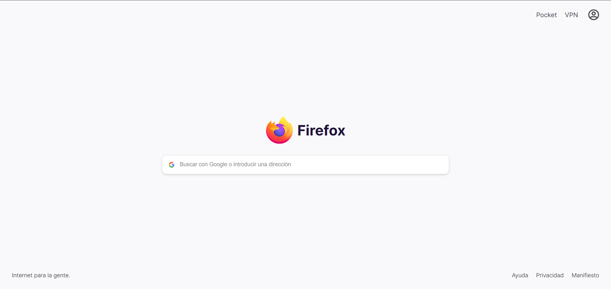
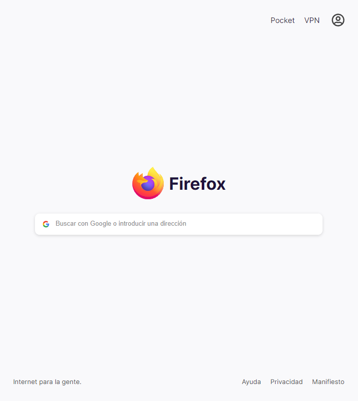
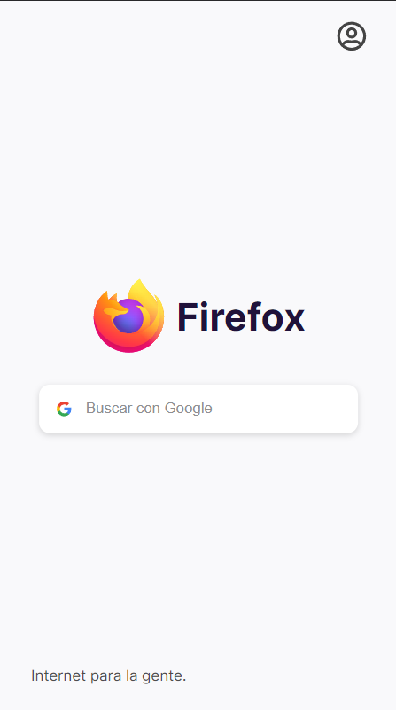

# Firefox Clone

## General

### Description

Mozilla Firefox clone with some modifications for practicing basic web development
and responsive design using **HTML** & **CSS**.

It was done as a practice for the "Practical HTML and CSS Course" of Platzi:

### Author

Sebastian Valencia Zapata - @sebas.nop

## Responsive design

The design and development of this clone was thinked from "First Mobile" paradigm.

The product fits well on the next devices:

### Desktop

### Tablet

### Mobile

